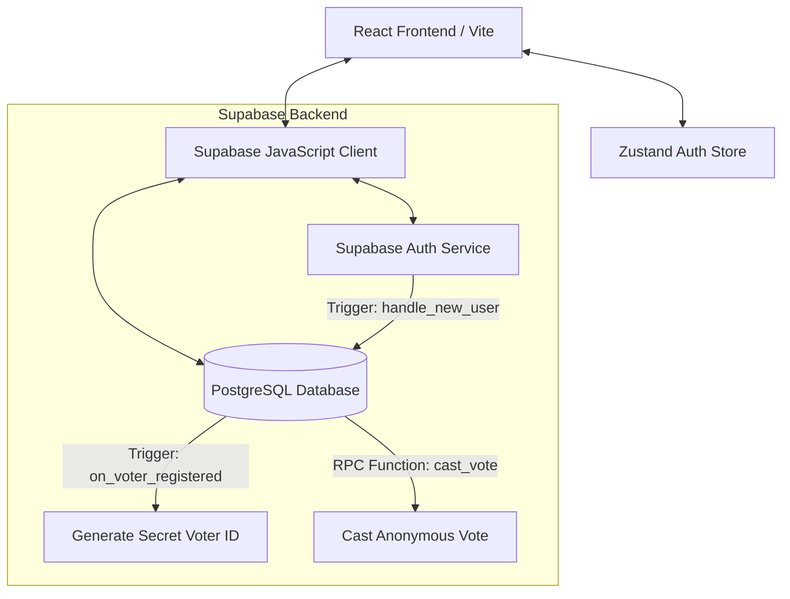

# Secure Online Election Management System

A premium, full-stack, secure online election and voting management system built using **React (TypeScript)**, **Zustand**, **Tailwind CSS**, and **Supabase (PostgreSQL + Auth)**. 

This platform enables cryptographic security, anonymous voting ledger auditing, admin approval gates for election creators, and real-time live results visualizations.

---

## System Architecture



---

## Key Features

### 1. Role-Based Authentication & Authorization
* **Super Admin**: Overrides and manages user roles, reviews creator approval requests, monitors live audit logs, and exports system actions to CSV.
* **Election Creator**: Requests platform approval, configures multi-candidate elections, sets voter capacity, manages candidate rosters, and views live dashboards.
* **Voter**: Registers for active elections, obtains secure unique voter secret codes, casts anonymous votes, and views live election leaderboards.

### 2. Double-Gate Approval Protocol
* New election creators cannot host polls immediately. They must submit details (purpose, organization, name) to request approval.
* Super Admins approve or reject requests inside the Admin Approvals Dashboard.

### 3. Cryptographic Secret Voter Codes
* Upon registering for an election, the PostgreSQL database trigger automatically generates a secure unique code (`POLL-YYYY-XXXX`).
* The code is fetched securely from the database and displayed to the voter. The client has no input on code generation, securing against forgery.

### 4. Fully Anonymous Voting Ledger
* Votes are cast using a secure Database RPC function `cast_vote()` which validates the secret voter code, checks if it's already used, inserts an anonymous vote record, marks the code as used, and saves a system audit log.
* The public results page renders a **Public Cryptographic Audit Ledger** containing vote signatures (UUIDs) and timestamps, allowing anyone to verify the authenticity of the election outcome without compromising voter anonymity.

---

## Live Demo Accounts & Credentials

For evaluation and testing purposes, you can use the pre-configured demo credentials below:

| Role | Email | Password | Access Status |
| :--- | :--- | :--- | :--- |
| **Super Admin** | `admin@voting.com` | `demo123` | Active / Pre-seeded |
| **Election Creator** | `creator@voting.com` | `demo123` | Active / Pre-approved |
| **Voter** | `voter@voting.com` | `demo123` | Active / Pre-seeded |

---

## Local Setup & Installation

### Prerequisites
* **Node.js** (v18 or higher)
* **Supabase Account / Project**

### 1. Database Schema Setup
1. Log in to your **Supabase Dashboard**.
2. Go to the **SQL Editor** tab.
3. Click **New Query**.
4. Open the [20260520000000_initial_schema.sql](file:///supabase/migrations/20260520000000_initial_schema.sql) file from this repository, copy the contents, paste them into the Supabase editor, and click **Run**.
5. *Optional*: Open the [seed_demo_users.sql](file:///supabase/seed_demo_users.sql) file, copy the contents, and run it in the editor to automatically seed the demo credentials.

### 2. Frontend Configuration
1. Navigate to the `Client` directory:
   ```bash
   cd Client
   ```
2. Install npm dependencies:
   ```bash
   npm install
   ```
3. Create a `.env` file in the root of the `Client` directory and add your Supabase credentials:
   ```env
   VITE_SUPABASE_URL=https://your-project-ref.supabase.co
   VITE_SUPABASE_ANON_KEY=your-supabase-anon-key
   ```
4. Start the local Vite development server:
   ```bash
   npm run dev
   ```
5. Open your browser and navigate to `http://localhost:5173`.

---

## Security Implementation Details

* **Row Level Security (RLS)**: Active on all database tables. All query constraints are enforced database-side based on `auth.uid()` and roles.
* **SQL Injection & Privilege Escalation Protection**: The cast vote process runs inside a `SECURITY DEFINER` function with strict variable validation, eliminating direct client write access to the ledger.
* **Audit Logging**: Fully automated database event tracking for credential updates, administrative role changes, vote castings, and approval requests.
