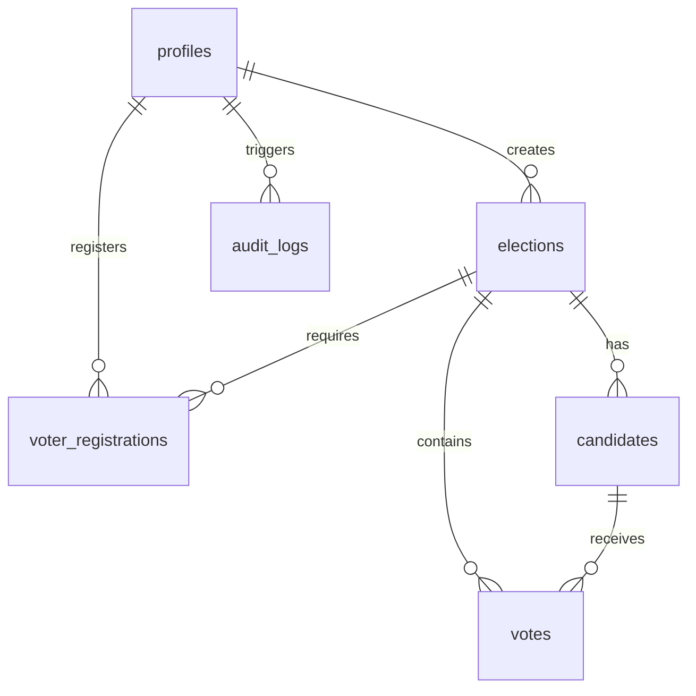
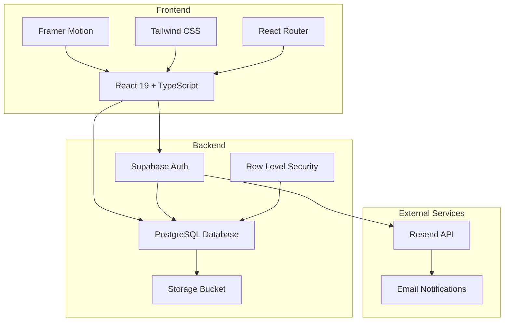

# 🗳️ Secure Online Election Management System

[](https://vite.dev/)
[](https://react.dev/)
[](https://www.typescriptlang.org/)
[](https://supabase.com/)
[](https://tailwindcss.com/)
[](https://www.framer.com/motion/)

A premium, state-of-the-art **Secure Online Election Management System** engineered with a sleek, responsive Bento-Grid UI, smooth micro-interactions, robust multi-role access controls, and full database-level security. Built on top of **React 19, TypeScript, Vite, Supabase, and Framer Motion**, this platform ensures high accessibility, complete auditability, and bulletproof voter anonymity.

---

## 🌟 Key Features & User Roles

The platform is designed with three distinct user roles, each featuring custom dashboards and specialized workflows.

### 👤 1. Voter Portal
*   **Secure Registration**: Register for active elections with credentials and secure, hashed identity verification.
*   **Voter Verification**: Unique, masked voter secret keys generated upon registration approval (`****7821`) for secure check-in.
*   **Anonymous Double-Voting Prevention**: Casts votes using database-enforced cryptographic hashes. Nobody (not even admins) can link your vote back to your profile, while ensuring you can only vote once.
*   **Registration & Waitlist**: Automated registration window checks. If the election registration limit is reached, users are automatically placed on a **Waitlist** (`waitlisted` status) and notified.
*   **Interactive Results**: View real-time election results, candidate breakdowns, and historical details for completed elections.

### ✍️ 2. Election Creator Hub
*   **Intuitive Creator Dashboard**: Overview of created elections, registration metrics, and approval queues.
*   **Dynamic Election Builder**: Design elections with custom titles, descriptions, custom categories, max voter counts, and strict timeline enforcement (Start/End times, Registration Deadlines).
*   **Drafts & Publishing**: Save elections as drafts for layout adjustment or publish them immediately.
*   **Candidate Management**: Add candidates, upload headshots directly to the Supabase Storage bucket `candidate-photos` (via public URL retrieval), input official designations, and draft manifestos.
*   **Voter Finalization & Lock**: Finalize the voter registration list. Upon finalization, the voter list is locked (`is_locked = true`), and the system automatically generates sequential, unique Secret IDs (e.g., `POLL-S-0001`), hashes them, and notifies approved voters.

### 🛡️ 3. Super Admin Command Center
*   **Platform Control Center**: Manage platform-wide statistics, active users, and system configuration.
*   **Creator Account Approvals**: Review pending `election_creator` accounts, read their specified election purpose, and approve or reject them with a custom reason.
*   **Admin Overrides**: Override locked voter lists or manually register voters directly to accommodate exceptional operational requests.
*   **Immutable Audit Trail**: Fully queryable logging system tracking platform actions, user IDs, timestamped metadata, and IP addresses to prevent tampering.

---

## 🔒 Security Architecture

Security is at the heart of this system, implementing cutting-edge mechanisms to ensure fair, transparent, and untamperable elections.

### 🛡️ Row Level Security (RLS)
All database interactions are locked down using Supabase **Row Level Security (RLS)**. No user can read or write to tables without validated permission checks:
*   **Profiles**: Public names are globally viewable to build trust, but write-access is locked to the authenticated owner.
*   **Elections**: Users can only see elections if they are published, active, completed, or if they are the creator.
*   **Voter Registrations**: Users can see only their own registration status. Creators can see all registrations *only* for the elections they manage.
*   **Votes**: Blind-insert policies ensure that votes can be pushed to the database anonymously, but never retrieved individually with a user linkage.

### 🎭 Anonymity & Integrity Protection
*   **Secret ID Verification**: Voters check in using a generated Secret ID (e.g., `POLL-S-0001`). At verification, the entered ID is Base64 encoded (`btoa`) and compared against the database `secret_id_hash`. This ensures that even the database administrators cannot decode voters' raw secret IDs.
*   **Double-Voting Check**: Each vote record is written with a `voter_hash` representing a hashed combination of the voter's identity and the election. Since the `voter_hash` is unique within an election (`UNIQUE(election_id, voter_hash)`), double-voting is physically prevented at the database level.
*   **Anonymity Guarantee**: The database has **no foreign key** or reference path between the `votes` table and the `profiles` or `users` table. The voter's identity is completely severed from the choice they make.

---

## 📊 Database Schema

Below is the entity-relationship mapping of the core PostgreSQL database schema deployed on Supabase:



### Table Breakdown
| Table Name | Primary Key | Description | Key Fields & Constraints |
| :--- | :--- | :--- | :--- |
| **`profiles`** | `id` (UUID) | Extends `auth.users` with user roles and organizations | `role` (voter/creator/admin), `is_approved`, `rejection_reason` |
| **`elections`** | `id` (UUID) | Contains election parameters and timelines | `creator_id`, `start_date`, `end_date`, `status`, `max_voters`, `is_locked` |
| **`candidates`** | `id` (UUID) | Profiles of individuals running in an election | `election_id`, `name`, `manifesto`, `designation`, `photo_url` |
| **`voter_registrations`**| `id` (UUID) | Junction table for voter-to-election tracking | `election_id`, `user_id`, `secret_id_hash`, `masked_secret_id`, `status` |
| **`votes`** | `id` (UUID) | Secure, anonymous cast ballot records | `election_id`, `candidate_id`, `voter_hash` (Unique Index) |
| **`audit_logs`** | `id` (UUID) | Immutable platform-wide action logs | `user_id`, `action`, `metadata` (JSONB), `ip_address` |

---

## 💻 Tech Stack & Design Choices

### Frontend
*   **React 19 (TypeScript)**: Utilizing modern Hooks and React Router DOM v7 for dynamic layout nesting.
*   **Framer Motion**: Delivers immersive transitions, spring-physics-based UI motions, and a premium custom cursor.
*   **Recharts**: Powers the election results visualization with responsive, interactive bar and pie charts.
*   **Tailwind CSS**: Beautiful, modular layout using CSS variables, custom typography, glassmorphic cards, and high-contrast dark modes.
*   **Sonner**: Clean, rich-color micro-toasts delivering immediate feedback on user authentication, registration, and casting votes.
*   **React Hook Form & Zod**: Secure, client-side validation schema ensuring inputs comply before making database transactions.

### Backend & Infrastructure
*   **Supabase (PostgreSQL)**: Handles Authentication, relational data, and enforces advanced security policies (RLS).
*   **Supabase Storage**: A bucket named `candidate-photos` holds candidate photos securely.
*   **Resend API**: Handles automated emailing of Secret IDs and Creator approval notifications. A mock toast/log fallback is triggered if the API key is not configured.
*   **Triggers & Functions**: Automatons (like `public.handle_new_user`) that auto-create user profiles upon successful Supabase signup.

---

## 🏗️ System Architecture



---

## 🛠️ Storage Bucket Configuration

To support candidate photo uploads, please ensure the `candidate-photos` bucket is created in Supabase Storage with **public read access**:
1. Go to the **Storage** page in your Supabase Dashboard.
2. Click **New Bucket** and name it `candidate-photos`.
3. Set the bucket to **Public** so public URLs are accessible.
4. Add the following policy for inserts/uploads if desired:
   - **Allowed operations**: `INSERT`, `UPDATE`, `SELECT`
   - **Target**: Authenticated users can insert/update objects under their elections.

---

## 🚀 Local Quickstart

### Prerequisites
*   [Node.js](https://nodejs.org/) (v18+ recommended)
*   [npm](https://www.npmjs.com/) (or yarn/pnpm)

### 1. Clone & Install Dependencies
```bash
git clone https://github.com/Abdulahad-web-dev/Votting-Managment-System.git
cd Votting-Managment-System
npm install
```

### 2. Configure Environment Variables
Create a `.env` file in the root directory:
```env
VITE_SUPABASE_URL=https://your-supabase-project-url.supabase.co
VITE_SUPABASE_ANON_KEY=your-supabase-anon-key
VITE_RESEND_API_KEY=your-optional-resend-api-key
```

### 3. Deploy Supabase Schema
Copy the contents of `supabase/schema.sql` and run it in the **SQL Editor** of your Supabase dashboard to instantly configure the database tables, triggers, and Row Level Security (RLS) policies.

### 3.5. Create Demo Users (Optional)
To create demo user accounts for testing:
1. Go to **Authentication** > **Users** in your Supabase Dashboard
2. Click **"Add user"** and **"Create new user"**
3. Manually create the following users with password `Demo@123`:
   - demo.voter@example.com (Voter)
   - demo.creator@example.com (Election Creator)
   - demo.admin@example.com (Super Admin)
4. After creating users, run the SQL script `supabase/demo-users.sql` in the **SQL Editor** to set up their profiles with appropriate roles.

**Important**: Do NOT create users directly via SQL in auth.users table. Supabase Auth uses PBKDF2 with SHA256 password hashing which is incompatible with PostgreSQL's crypt() function. Always create users through the Supabase Dashboard or Auth API.

### 4. Run Development Server
```bash
npm run dev
```
Open your browser and navigate to `http://localhost:5173`.

---

## 🔐 Demo Credentials

For testing purposes, you can use the following demo accounts. All accounts use the same password for convenience.

| Role | Email | Password |
| :--- | :--- | :--- |
| **Voter** | demo.voter@example.com | Demo@123 |
| **Election Creator** | demo.creator@example.com | Demo@123 |
| **Super Admin** | demo.admin@example.com | Demo@123 |

**Note**: These demo accounts should be created in your Supabase Auth dashboard before testing. You can create them manually in the Supabase Dashboard under Authentication > Users.

---

## 🛠️ Build and Deploy

To compile the application for production:
```bash
npm run build
```
This outputs an optimized bundle to the `dist/` directory, ready to be hosted on Vercel, Netlify, or AWS.

---

## 📝 License

This project is licensed under the MIT License.
